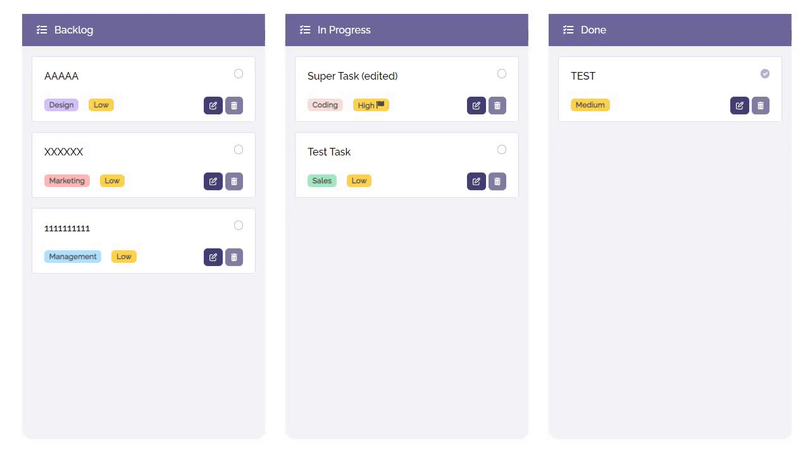

<br>

<div align="center">
    
    <h3 align="center">Ironhack Final Project</h3>
    <div align="center">
        <a href="https://ironhack-finalproject.netlify.app/">View Netlify deployed demo</a>
        ·
        <a href="https://docs.google.com/presentation/d/1mnXjQ9IEkfew6dWl2xO9VFnPTMXyNz31r5iGNq0uHgM">View the presentation</a>
        ·
        <a href="https://github1s.com/jarDotNet/ironhack_finalproject/">Browse the project code</a>
    </div>
    <br />
    <div align="center">
        
    </div>
</div>

# TrackLab To-do app

Ironhack Frontend final assignment project. The objective is to build and deploy a To-do app with Vue.js that allows users to create an account, record tasks, edit them and mark them as complete. The app is linked to a database, where all the user and task data is stored.

The database used for this project is [`Supabase`](https://supabase.com/). We also used [`Vite`](https://vitejs.dev/guide/) as a build tool to compile our code and provide a development server while we work.

## Project setup

```bash
npm install
```

### Environment variables

Set Up your Environment Variables from Supabase, either in an `.env` local file, or by means of Build environment variables:

```script
VITE_SUPABASE_URL=<SUPABASE PROJECT URL>
VITE_SUPABASE_ANON_KEY=<SUPABASE PROJECT API KEY>
```

### Supabase

In addition to having a __Project URL__ and a __Project API Key__, to configure `Supabase`, you need to run the following scripts:

<details>
  <summary>For the <strong>tasks</strong> table:</summary>

```script
CREATE TYPE task_state AS ENUM ('pending', 'in-progress', 'completed');
CREATE TYPE task_priorities AS ENUM ('Low', 'Medium', 'High');
CREATE TYPE task_categories AS ENUM ('Marketing', 'Coding', 'Design', 'Sales', 'Management');
create table tasks (
  -- This first part sets up the tables
  id bigint generated by default as identity primary key,
  user_id uuid references auth.users not null,
  title text check (char_length(title) > 3),
  description text,
  current_state task_state default 'pending',
  priority task_priorities default 'Low',
  category task_categories,
  pos float8 not null,
  inserted_at timestamp with time zone default timezone('utc'::text, now()) not null
);
alter table tasks enable row level security;
-- Then it creates a policy that lets authenticated users create task
create policy "Individuals can create a task." on tasks for
insert with check (auth.uid() = user_id);

-- Then it creates a policy that users can only view their own task (select task based on user id)
create policy "Individuals can view their own task. " on tasks for
select using (auth.uid() = user_id);
-- Then it does the same only for update
create policy "Individuals can update their own task." on tasks for
update using (auth.uid() = user_id);
-- And again for delete
create policy "Individuals can delete their own task." on tasks for
delete using (auth.uid() = user_id);
```
</details>

<details>
  <summary>And for the <strong>profiles</strong> table:</summary>

```script
-- Create a table for public "profiles"
create table profiles (
  id uuid references auth.users not null,
  updated_at timestamp with time zone,
  username text unique,
  avatar_url text,
  website text,

  primary key (id),
  unique(username),
  constraint username_length check (char_length(username) >= 3)
);

alter table profiles enable row level security;

create policy "Public profiles are viewable by everyone."
  on profiles for select
  using ( true );

create policy "Users can insert their own profile."
  on profiles for insert
  with check ( auth.uid() = id );

create policy "Users can update own profile."
  on profiles for update
  using ( auth.uid() = id );

-- Set up Realtime!
begin;
  drop publication if exists supabase_realtime;
  create publication supabase_realtime;
commit;
alter publication supabase_realtime add table profiles;

-- Set up Storage!
insert into storage.buckets (id, name)
values ('avatars', 'avatars');

create policy "Avatar images are publicly accessible."
  on storage.objects for select
  using ( bucket_id = 'avatars' );

create policy "Anyone can upload an avatar."
  on storage.objects for insert
  with check ( bucket_id = 'avatars' );
```
</details>

<details>
  <summary>For the <strong>avatars</strong> bucket, in <strong>Storage</strong>:</summary>

- Make the `avatars` bucket __public__. 
- In the Configuration `Policies`, be sure you have these defined:
  - DELETE: Anyone can delete an avatar.
  - UPDATE: Anyone can update an avatar.
  - INSERT: Anyone can upload an avatar.
  - SELECT: Avatar images are publicly accessible.

</details>

### Compiles and hot-reloads for development

```bash
npm run dev
```

### Compiles and minifies for production

```bash
npm run build
```

## About the project

Develop a Trello-like SPA running on `Vue 3` with `Composition API`, `Pinia` as state management library, `Vue Router`, `Vite`, and finally `Supabase` running on the backend side.

The design specifications of the project can be found in [Figma](https://www.figma.com/file/W9ZvODaw3gwFNvioF4FBos/KANBAN).

Here are also the [user stories](./readme/UserStories.md) required for this project, following [Gherkin](https://cucumber.io/docs/gherkin/reference/#keywords) keywords.

Netlify Live version Status:
<br />
[](https://app.netlify.com/sites/ironhack-finalproject/deploys)

### Authors

|                     | Name         | GitHub                                           |
| :------------------ | :----------- | :----------------------------------------------- |
| <a href="https://github.com/acalleja94"></a> | __Alba__     | [__@acalleja94__](https://github.com/acalleja94) |
| <a href="https://github.com/RaulFR01"></a> | __Raul__     | [__@RaulFR01__](https://github.com/RaulFR01)     |
| <a href="https://github.com/jarDotNet"></a> | __JA Reyes__ | [__@jarDotNet__](https://github.com/jarDotNet)   |

### Technical specifications

- __Cilent:__ [Vue.js](https://vuejs.org/), [Vite (dev server)](https://vitejs.dev/guide/)
- __Router:__ [Vue Router](https://router.vuejs.org/)
- __Store:__ [Pinia](https://pinia.vuejs.org/) and [Pinia Persist](https://seb-l.github.io/pinia-plugin-persist/) for persistent login and other shared stuff
- __Database as a service:__ [`Supabase`](https://supabase.com/)
- __Drag and Drop:__ [vue3-smooth-dnd](https://github.com/gilnd/vue3-smooth-dnd) library (Vue 3 Wrapper of [smooth-dnd](https://github.com/kutlugsahin/smooth-dnd) library)
- __UI libraries:__  [Bootstrap](https://getbootstrap.com/), [Fort Awesome](https://fortawesome.com/), [Heroicons](https://heroicons.com/), [Iconoir](https://iconoir.com/), [ress](https://github.com/filipelinhares/ress)

### Features

This project includes the following functionalities and features:

- Responsive web dessign, including hamburger menu
- Authentication flow (including Sign In, Sign Up and Sign Out)
- Database as a Service (for Authentication, Users, Tasks, and user Profiles)
- Ability to create, edit, delete or mark tasks as complete/incomplete
- Drag and Drop of tasks on the Kanban board
- A store and a database that the app calls to request or update data
- SPA using Vue components and Page routing
- CSS animations (for the Avatar button, and the name of the app in the header of the Home page)
- 404 Not Found error page
- Form validation
- Favicon

### Built With

- 
- 
- 
- 
- 
- 
- 
- 
- 
